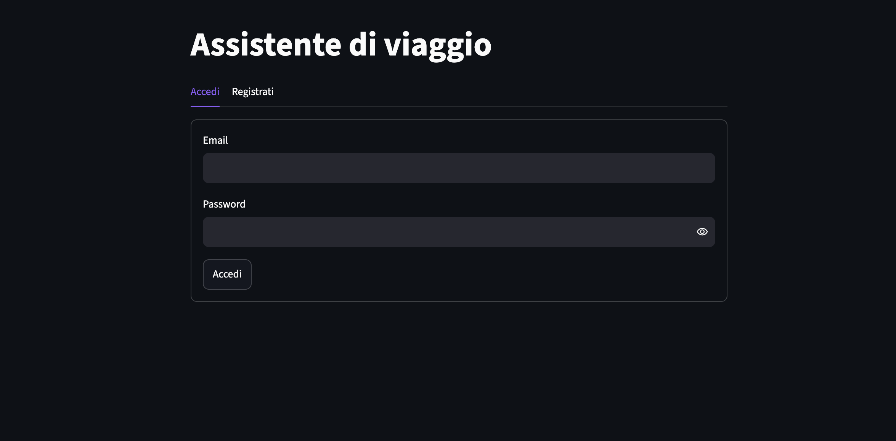
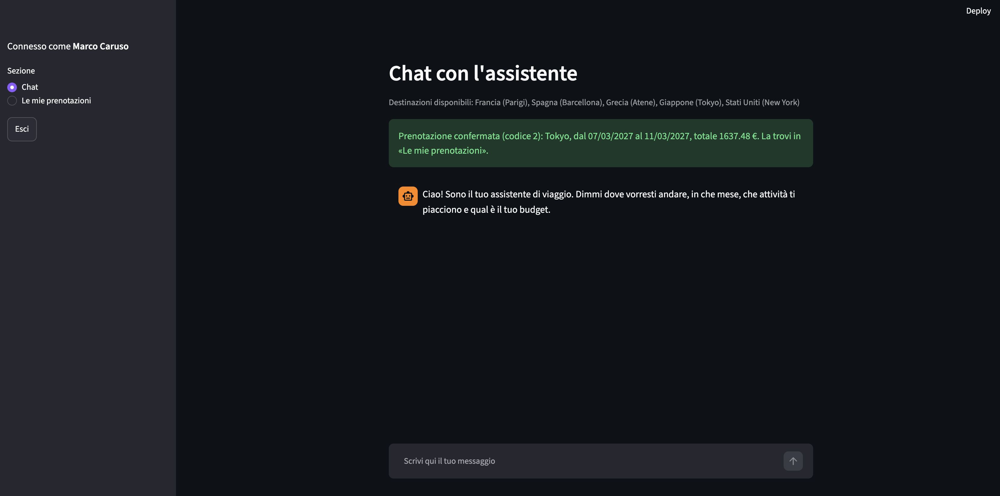
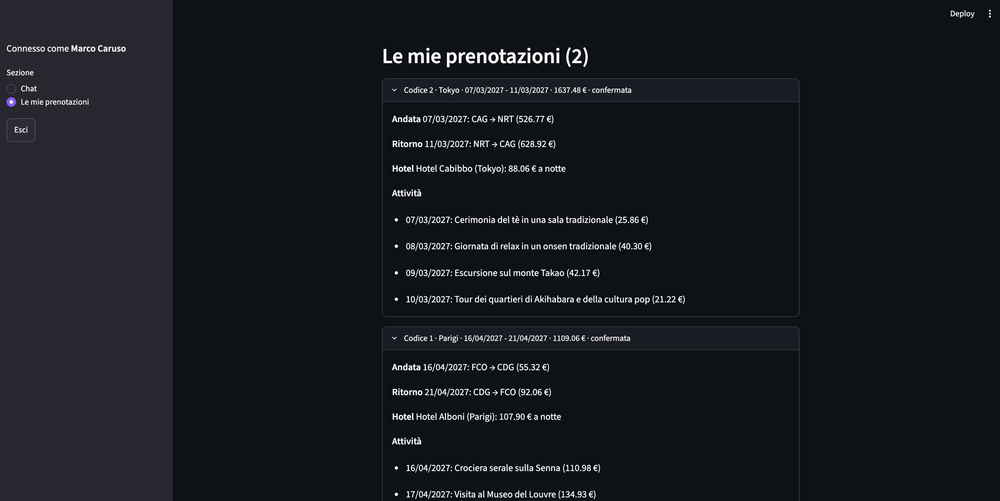

# Travel Assistant

Assistente virtuale conversazionale per viaggi personalizzati, sviluppato come
challenge tecnica. L'utente chiede in chat un viaggio (budget, nazione, mese,
preferenze) e l'assistente compone un itinerario completo (volo di andata e
ritorno, hotel per ogni notte, un'attività al giorno) che si può prenotare
direttamente dalla conversazione.

Il principio che guida il progetto: **il codice decide, il modello linguistico no.**
Prezzi, date, disponibilità e budget sono calcolati in modo deterministico dal
database; Claude serve solo a capire cosa scrive l'utente, e la ricerca semantica
(RAG) solo a ordinare le attività per affinità con le sue preferenze.
Le motivazioni delle scelte sono in [`docs/architecture.md`](docs/architecture.md).

## Avvio rapido

Requisiti: Git, Python 3.11, [uv](https://docs.astral.sh/uv/), una API key Anthropic
(la fornisco insieme al link della repository).

<details>
<summary>Non hai questi strumenti installati? Espandi</summary>

**Git**
- Windows: [git-scm.com/download/win](https://git-scm.com/download/win)
- macOS: `xcode-select --install` (installa i tool da riga di comando, git incluso)
- Linux: `sudo apt install git` (Debian/Ubuntu) o equivalente per la tua distro

**Python 3.11**
- Windows/macOS: [python.org/downloads](https://www.python.org/downloads/) (su Windows, durante l'installazione spunta "Add python.exe to PATH")
- Linux: `sudo apt install python3.11` o equivalente

**uv**
- Windows (PowerShell): `powershell -ExecutionPolicy ByPass -c "irm https://astral.sh/uv/install.ps1 | iex"`
- macOS/Linux: `curl -LsSf https://astral.sh/uv/install.sh | sh`

Dopo ogni installazione, **chiudi e riapri il terminale** prima di continuare: il PATH si
aggiorna solo così. Puoi verificare con `git --version`, `python3 --version` (o `python
--version` su Windows) e `uv --version`.

</details>

**1. Installazione**

```bash
git clone https://github.com/marco-caruso/travel-assistant.git
cd travel-assistant
uv sync
cp .env.example .env
```

**2. Configurazione.** Apri `.env` e compila due variabili, senza spazi né virgolette:

- `ANTHROPIC_API_KEY=` la chiave che ho fornito;
- `JWT_SECRET=` una stringa casuale a tua scelta, per esempio generata con
  `python3 -c "import secrets; print(secrets.token_hex(32))"` (su Windows, se `python3` non è
  riconosciuto, usa `python` al posto di `python3`).

Senza `JWT_SECRET` il login fallisce con errore: è voluto, per non usare mai un segreto di ripiego.

**3. Backend** (primo terminale)

```bash
cd backend
uv run uvicorn app.main:app --reload
```

API su `http://127.0.0.1:8000`, documentazione interattiva su `/docs`.
Al **primo avvio** il backend costruisce da solo l'indice vettoriale (cartella
`data/chroma/`, non versionata perché rigenerabile) e scarica il modello di
embedding: servono internet e qualche decina di secondi. Dagli avvii successivi è immediato.

**4. Frontend** (secondo terminale, sempre dalla radice del progetto)

```bash
uv run streamlit run frontend/app.py
```

Si apre su `http://localhost:8501`. Se Streamlit chiede un'email al primo avvio, premi Invio.

## Come provarlo

1. Nella scheda **Registrati** crea un account (l'email può essere inventata) ed entra.

   
2. Nella chat scrivi per esempio: *«Vorrei andare a New York a giugno, mi piacciono
   cultura e relax, budget 2000 €»*. Se manca qualcosa, l'assistente lo chiede.

  

3. Ricevi un itinerario con i costi. Per prenotare scrivi *«sì»* oppure usa il pulsante
   **Prenota questo itinerario**. Puoi anche cambiare idea con il pulsante **Non prenotare**
   (o scrivendo *«no grazie»*), oppure modificare budget, mese o preferenze: ne viene generato uno nuovo.

   
4. In **Le mie prenotazioni** trovi tutte le prenotazioni dell'utente, con il loro codice.

   

Destinazioni disponibili: Francia (Parigi), Spagna (Barcellona), Grecia (Atene),
Giappone (Tokyo), Stati Uniti (New York). I voli coprono le date fino a ottobre 2027.

Nota: `data/travel.db` è versionato e le tue prove (utenti, prenotazioni) lo modificano.
Per riportarlo allo stato originale: `git restore data/travel.db`.

## Stack

| Componente           | Scelta                                          |
|----------------------|-------------------------------------------------|
| Backend              | FastAPI (Python 3.11), API REST                 |
| Database relazionale | SQLite + SQLAlchemy 2.0                         |
| Database vettoriale  | ChromaDB (locale, persistente, embedding ONNX)  |
| LLM                  | Claude Haiku 4.5 (Anthropic), con tool use      |
| Autenticazione       | JWT (PyJWT), password con hash scrypt           |
| Frontend             | Streamlit (client HTTP puro dell'API)           |
| Gestione pacchetti   | uv                                              |
| Dati sintetici       | Faker                                           |

## Struttura

```
backend/app/
├── api/    # endpoint REST (auth, chat, prenotazioni, itinerari, dati di consultazione)
├── core/   # logica di business: itinerario, validazione, prenotazione, conferma, sicurezza
├── db/     # modelli SQLAlchemy, sessione, seed dei dati sintetici
├── llm/    # estrazione strutturata dei dati di viaggio (Claude, tool use)
├── rag/    # generazione descrizioni, indicizzazione e ricerca semantica (Chroma)
├── main.py
└── schemas.py
frontend/app.py   # interfaccia Streamlit
data/             # travel.db, descrizioni_attivita.json, chroma/ (generata all'avvio)
docs/architecture.md
```

## API

Gli endpoint contrassegnati con 🔒 richiedono l'intestazione `Authorization: Bearer <token>`
(token ottenuto da `/auth/login`, valido 8 ore). In `/docs` si usa il pulsante *Authorize*.

| Metodo | Endpoint                | Descrizione                                                     |
|--------|-------------------------|-----------------------------------------------------------------|
| GET    | `/`                     | Health check                                                    |
| POST   | `/auth/registrazione`   | Crea un utente                                                  |
| POST   | `/auth/login`           | Restituisce il token di accesso                                 |
| GET    | `/auth/me` 🔒           | Profilo dell'utente autenticato                                 |
| POST   | `/chat` 🔒              | Un turno di conversazione: risposta, itinerario, eventuale prenotazione |
| POST   | `/prenotazioni` 🔒      | Prenota un itinerario (solo id: il server ricontrolla e ricalcola tutto) |
| GET    | `/prenotazioni` 🔒      | Prenotazioni dell'utente, dalla più recente                     |
| POST   | `/itinerari`            | Genera un itinerario da una richiesta strutturata               |
| GET    | `/destinazioni`         | Nazioni e città disponibili                                     |
| GET    | `/hotels`, `/voli`, `/attivita` | Dati di consultazione                                   |

## Funzionamento in breve

- **Chat senza stato sul server.** A ogni messaggio il client rimanda la conversazione
  intera e l'itinerario in attesa di conferma; da lì Claude estrae i dati aggregati
  (budget, nazione, preferenze, mese), il codice li valida e decide la domanda successiva.
- **Itinerario.** La durata (3-5 notti) non la sceglie l'utente: è la più lunga che entra
  nel budget. Si sceglie la combinazione volo + hotel più economica di quella durata, poi
  un'attività al giorno, la più adatta alle preferenze (RAG) e compatibile col budget residuo.
- **Prenotazione.** «Sì», «no» e simili sono riconosciuti da regole (`core/conferma.py`), non
  dal modello; in alternativa ci sono i pulsanti «Prenota» e «Non prenotare». Il client invia solo gli id: il server rilegge tutto dal database,
  ricontrolla disponibilità e budget, ricalcola il prezzo e salva in un'unica transazione.

## Limiti dichiarati e sviluppi futuri

Scelte fatte per restare nei tempi della challenge:

- **Nessun controllo di capienza:** la disponibilità di hotel e attività è un intervallo di
  date, non un calendario con posti; la stessa camera può essere prenotata più volte.
- **Una città per nazione**, cinque destinazioni, 15 attività per città, un'attività per giorno.
- **Pagamento non simulato**: la prenotazione nasce già «confermata».
- **Sessione Streamlit in memoria**: ricaricando la pagina del browser si rifà il login;
  la cronologia delle conversazioni non è salvata.
- **Token JWT di 8 ore, senza refresh né revoca**; endpoint di consultazione pubblici.
- **Ricerca semantica imperfetta:** si usa il modello di embedding di default di Chroma, addestrato soprattutto su inglese, mentre testi e query sono in italiano. Le prime posizioni sono quasi sempre coerenti con le preferenze (per «relax» spa e hammam, per «sport» bicicletta e corsa), ma nelle successive compare qualche attività fuori tema. Miglioria prevista: un modello di embedding multilingue.
- **Nessuna suite di test automatici** nel repository.

In produzione: Postgres al posto di SQLite, migrazioni (Alembic), gestione dei posti
disponibili, pagamento reale, refresh token e cookie httpOnly, frontend dedicato,
storico delle conversazioni. Tra le funzioni opzionali della traccia non sono state
realizzate: upload di immagini, modifica di itinerari già prenotati, storico delle conversazioni.

## Rigenerare i dati da zero (facoltativo)

I dati forniti sono già pronti e coerenti tra loro. Rigenerarli serve solo se si modificano
le destinazioni o le attività. Dalla cartella `backend/`, **in quest'ordine**:

```bash
uv run python -m app.db.seed                    # cancella e ricrea tutte le tabelle, utenti e prenotazioni compresi
uv run python -m app.rag.genera_descrizioni     # chiama Claude (costo trascurabile) e riscrive il JSON delle descrizioni
uv run python -m app.rag.indicizza_attivita     # aggiorna l'indice vettoriale
```

Se hai tolto o cambiato attività, cancella prima `data/chroma/` (`rm -rf ../data/chroma` su macOS/Linux,
`Remove-Item -Recurse -Force ../data/chroma` su Windows PowerShell): l'indicizzazione aggiorna le voci
esistenti ma non elimina quelle vecchie.

Il seed usa un valore fisso di riproducibilità, quindi a parità di codice produce gli stessi
dati; le date dei voli, però, partono dal giorno in cui viene eseguito.
